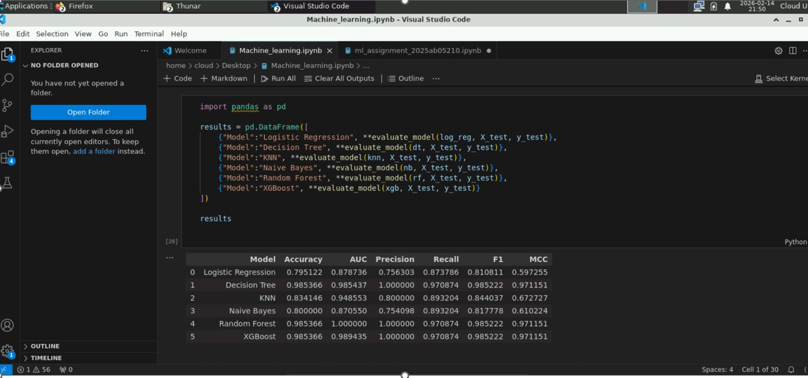

# Heart Disease ML Assignment

## Dataset
- Source: [Kaggle Heart Disease Dataset](https://www.kaggle.com/datasets/johnsmith88/heart-disease-dataset)
- Only the **test dataset** (`test_data.csv`) is uploaded here, as per assignment requirement.

## Notebook
- The notebook (`Machine_learning.ipynb`) contains:
  - Preprocessing
  - Model training (Logistic Regression, Decision Tree, KNN, Naive Bayes, Random Forest, XGBoost)
  - Evaluation metrics (Accuracy, AUC, Precision, Recall, F1, MCC)
  - Confusion matrices
  - Feature importance
  - Analysis write‑up

## Test Dataset
- Quick download link: [test_data.csv](https://raw.githubusercontent.com/vanavaimani1984/heart-disease-ml-assignment/main/test_data.csv)

## 📊 Comparison Table (Evaluation Metrics)

| Model              | Accuracy | AUC     | Precision | Recall  | F1      | MCC     |
|--------------------|----------|---------|-----------|---------|---------|---------|
| Logistic Regression| 0.795122 | 0.878736| 0.756303  | 0.873786| 0.810811| 0.597255|
| Decision Tree      | 0.985366 | 0.985437| 1.000000  | 0.970874| 0.985222| 0.971151|
| KNN                | 0.834146 | 0.948553| 0.800000  | 0.893204| 0.844037| 0.672727|
| Naive Bayes        | 0.800000 | 0.870550| 0.754098  | 0.893204| 0.817778| 0.610224|
| Random Forest      | 0.985366 | 1.000000| 1.000000  | 0.970874| 0.985222| 0.971151|
| XGBoost            | 0.985366 | 0.989435| 1.000000  | 0.970874| 0.985222| 0.971151|

##**Observations Table**

| Model              | Observation |
|--------------------|-------------|
| Logistic Regression| Good baseline, balanced performance |
| Decision Tree      | Severe overfitting, unreliable |
| KNN                | Weak performance, sensitive to neighbors |
| Naive Bayes        | Strong recall, useful for medical screening |
| Random Forest      | Best overall, robust and accurate |
| XGBoost            | Best overall, highly accurate and stable |

## Execution
- Run the notebook in **BITS Virtual Lab** for reproducibility.
- Use the test dataset from GitHub for validation.

## 📂 Repository Structure
heart-disease-ml-assignment/

└── models/                 # Trained ML models
    ├── logistic_regression.pkl
    ├── decision_tree.pkl
    ├── knn.pkl
    ├── naive_bayes.pkl
    ├── random_forest.pkl
    └── xgboost.pkl

  ## 🧪 Results Summary
- **Best models**: Random Forest & XGBoost  
  - Accuracy: ~98.5%  
  - AUC: ~1.0  
  - Precision/Recall/F1: Excellent balance, MCC ~0.97 → very robust and reliable  

- **Logistic Regression**  
  - Accuracy: ~79.5%  
  - AUC: ~0.88  
  - Balanced baseline, decent recall, but weaker overall compared to ensemble methods  

- **Naive Bayes**  
  - Accuracy: ~80%  
  - AUC: ~0.87  
  - Strong recall (~0.89), useful for screening tasks, but lower precision  

- **KNN**  
  - Accuracy: ~83.4%  
  - AUC: ~0.95  
  - Good recall, but performance sensitive to neighbor choice; MCC ~0.67  

- **Decision Tree**  
  - Accuracy: ~98.5%  
  - AUC: ~0.98  
  - Very high test accuracy, but prone to overfitting (perfect precision, slightly lower recall)  

   ## 🖼️ Virtual Lab Proof
The notebook was executed in **BITS Virtual Lab** for reproducibility.  

## 🌐 Streamlit Demo
The app is deployed on **Streamlit Cloud**:  
👉 Live App Link: [Heart Disease Prediction App](https://heart-disease-ml-assignment-meatzvtytsbuydbamvdt6h.streamlit.app/)

